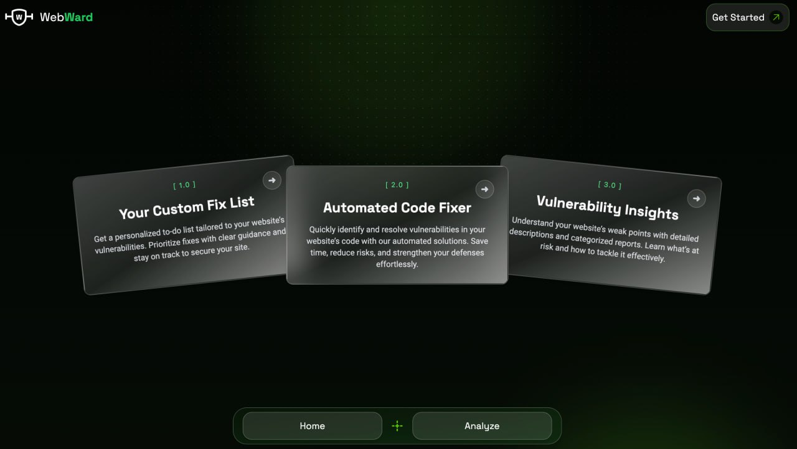
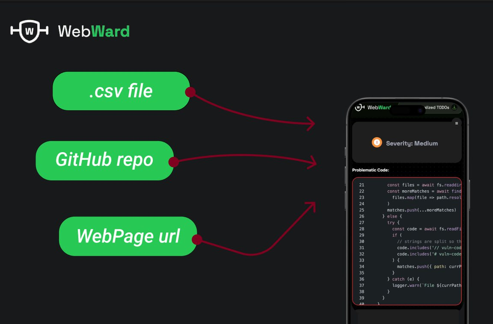
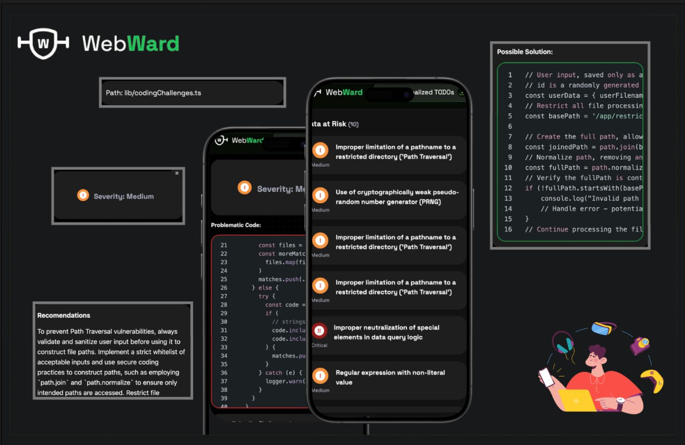

# Telecom_Hakathon2024

# Tech Stack

	<code></code>
	<code></code>
	<code></code>
	<code></code>
	<code></code>

# Inspiration

Our main inspiration comes from being cybersecurity students eager to gain hands-on experience in our field of study. Despite our theoretical knowledge, we had never had the opportunity to apply it in practice, and we thought, "If not now, during our bachelor's year, then when?" This project gave us the perfect chance to bridge that gap.

We also firmly believe that projects like this are essential for the development of secure web applications. Vulnerabilities are a real and constant threat, and the number of people who seek to exploit them is significant. Addressing these risks proactively is not just a learning opportunity but also a necessity for creating a safer digital environment.

# What It Does

Our web application takes three inputs:

1. A link to the web page.
2. A link to the respective GitHub repository for the page.
3. A `.csv` file containing a list of vulnerabilities related to the page.

   

In the background, the application tests which vulnerabilities are exploitable. As output, it displays:

- The exploitable vulnerabilities.
- A short description of each vulnerability.
- The location in the code causing the vulnerability.
- Recommended mitigation steps.

  

# How We Built It

To build the application, we used several server-side programming languages, frameworks, and a trained OpenAI model. The components include:

- **Front-end**: Built using _SvelteKit_ and _Tailwind CSS_.
- **Back-end**: Developed using _Java_.
- **Vulnerability Testing**: A _Python script_ checks if the provided vulnerabilities are exploitable.
- **OpenAI Model**: Simulates attacks and formats the output into a human-readable form.

# Figma Board
Presentation for our work available here : [Figma](https://www.figma.com/design/wFmSR4CkxYzdcbI2x4a6ts/WebWard?node-id=0-1&t=afJ5xMjNSjtoF9WN-1)

# Challenges We Ran Into

The main challenge for us was determining whether a vulnerability is truly exploitable. Having never worked on a similar task before, we were initially unsure about the algorithms and methods needed to achieve this goal. Our knowledge was limited to theoretical concepts, making it difficult to apply them in practice. Overcoming this hurdle required extensive research, experimentation, and learning, which eventually helped us develop a functional approach despite our initial inexperience.

# Accomplishments That We're Proud Of

While our application is not perfect, we take great pride in both our idea and the effort we’ve put into creating a user-friendly and visually appealing front end. The design of our interface is intuitive and engaging, ensuring that users can easily interact with the application. We’re confident that our idea has the potential to make a meaningful impact in the realm of vulnerability testing and mitigation.

# What We Learned

This project taught us a great deal about:

- Penetration testing.
- Various types of vulnerabilities and how they can be exploited.
- The practical aspects of identifying security flaws and understanding their potential impact.

We also realized the importance of teamwork. Effective collaboration, communication, and shared effort are essential for overcoming challenges and successfully completing complex tasks under time pressure.

# What's Next for WebWard

Our solution is not perfect, and we recognize there is room for improvement. The next steps in the project’s development include:

1. Strengthening the back-end performance and reliability by:
   - Implementing a more robust algorithm for processing `.csv` files efficiently and accurately.
   - Refining the detection of exploitable vulnerabilities to ensure higher precision.
2. Further developing the OpenAI model to produce even more accurate and relevant outputs for vulnerability descriptions and mitigation steps.

